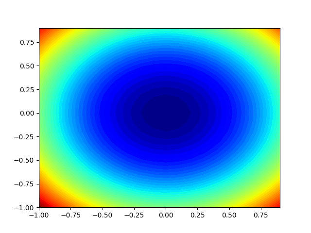
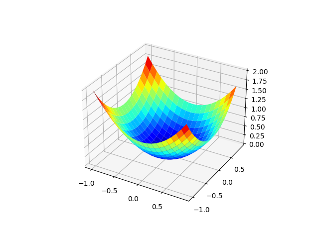
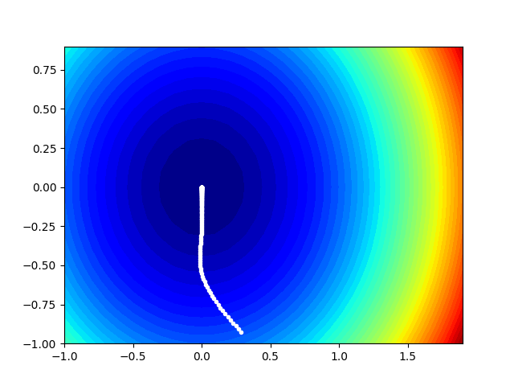

# Adam Gradient Descent implementation
In these short codes I implemented an example of the Adam gradient descent optimization algorithm.
The optimization is done on a simple convex cost function `f(x,y) = x^2 + y^2`.

## Usage
`python3 space_2d.py`	-> Plot the mathematical space in 2D  
 
`python3 space_3d.py`	-> Plot the mathematical space in 3D  
 
`python3 adam_implementation`	-> Run the Adam Gradient Optimization over the function  
 
## Credits
1. https://machinelearningmastery.com/adam-optimization-from-scratch/, Code Adam Optimization Algorithm From Scratch, Jason Brownlee, 2021
2. https://arxiv.org/abs/1412.6980, Adam: A Method for Stochastic Optimization, Diederik P. Kingma, Jimmy Ba, 2014
